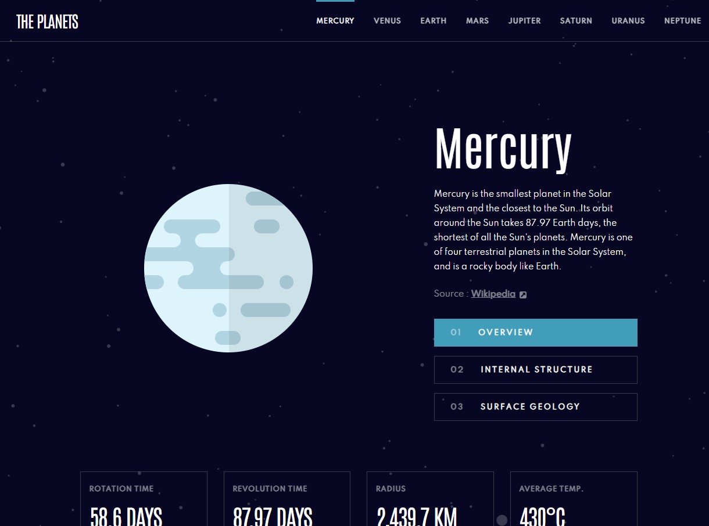

# Frontend Mentor - Planets fact site solution

This is a solution to the [Planets fact site challenge on Frontend Mentor](https://www.frontendmentor.io/challenges/planets-fact-site-gazqN8w_f).

## Table of contents

- [Overview](#overview)
  - [The challenge](#the-challenge)
  - [Screenshot](#screenshot)
  - [Links](#links)
- [My process](#my-process)
  - [Built with](#built-with)
- [Author](#author)

## Overview

### The challenge

Users should be able to:

- View the optimal layout for the app depending on their device's screen size
- See hover states for all interactive elements on the page
- View each planet page and toggle between "Overview", "Internal Structure", and "Surface Geology"

### Screenshot

### Links

- Solution URL: [Github Repo](https://github.com/sophia-banou/planets-facts)
- Live Site URL: [Github Pages](https://sophia-banou.github.io/planets-facts/)

## My process

### Built with

- HTML
- CSS
- Astro
- React
- JQuery

## Author

- Frontend Mentor - [@sophia-banou](https://www.frontendmentor.io/profile/sophia-banou)
